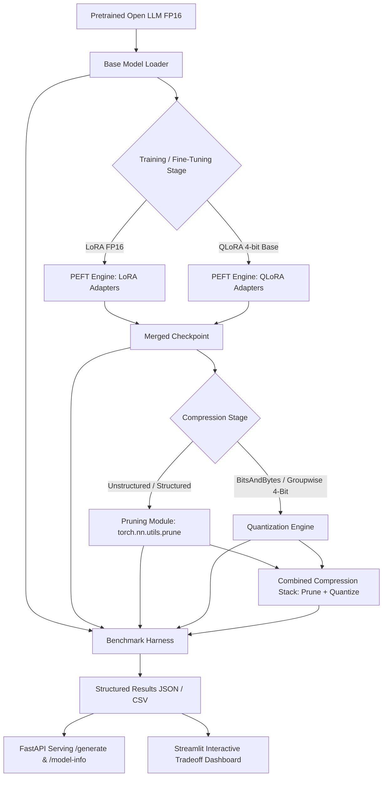

# EdgeTune Architecture & Engineering Design Document

## System Architecture

---

## Key Modules & Design Patterns

### 1. Device-Agnostic Model Loader (`model_loader.py`)
- Automatically resolves hardware execution targets: `cuda`, Apple Silicon `mps`, or `cpu`.
- Standardizes precision handles (`float16`, `bfloat16`, `float32`).
- Computes exact in-memory parameter tensor byte allocations (`get_model_size_mb`).

### 2. PEFT Engine (`peft_trainer.py`)
- Low-Rank Adaptation (LoRA) injects trainable rank decomposition matrices into attention projections (`q_proj`, `v_proj`, `k_proj`, `o_proj`):
  $$W' = W_0 + \frac{\alpha}{r} (A \cdot B)$$
- QLoRA initializes the base model in 4-bit NormalFloat (NF4) with double quantization, reducing base memory overhead by ~75% during training.

### 3. Multi-Backend Quantization Engine (`quantizer.py`)
- **BitsAndBytes Quantizer**: Integrates 4-bit NF4/FP4 and LLM.int8() vector quantization.
- **Groupwise 4-Bit Weight Quantizer**: Implements uniform block quantization ($g=128$) with per-block scale and zero-point parameters:
  $$q = \text{clamp}\left(\text{round}\left(\frac{w - w_{\text{min}}}{S}\right), 0, 15\right)$$
  Bit-packs two 4-bit values per `uint8` byte for real memory reduction.
- **PyTorch Dynamic INT8**: CPU linear module quantization.

### 4. Pruning Engine (`pruner.py`)
- **Unstructured L1 Magnitude Pruning**: Computes global or module-wise $L_1$ norm thresholds and masks weights:
  $$M_{i,j} = \mathbb{I}(|W_{i,j}| \ge \tau)$$
- **Structured Channel/Head Pruning**: Zeroes out full channels/heads based on $L_2$ norm.
- **Permanent Removal**: Invokes `torch.nn.utils.prune.remove` to solidify sparse tensor representations.

### 5. Benchmark Harness (`benchmark.py`)
- Calculates Time-To-First-Token (TTFT in ms) using synchronous single-token generation.
- Calculates generation throughput (Tokens/sec) over fixed token generation lengths.
- Evaluates dialogue summarization ROUGE-1, ROUGE-2, and ROUGE-L metrics against validation ground truth.
- Measures peak allocated memory (`torch.cuda.max_memory_allocated`, `torch.mps.current_allocated_memory`, `psutil.Process.rss`).

---

## Hardware Compatibility & Performance Considerations

EdgeTune natively scales across:
- **NVIDIA GPUs (CUDA)**: Native float16/bfloat16, BitsAndBytes 4-bit/8-bit, full CUDA event timer profiling.
- **Apple Silicon (MPS)**: Native PyTorch MPS tensor acceleration, metal memory allocation tracking.
- **CPU**: INT8 dynamic quantization, multithreaded evaluation.
