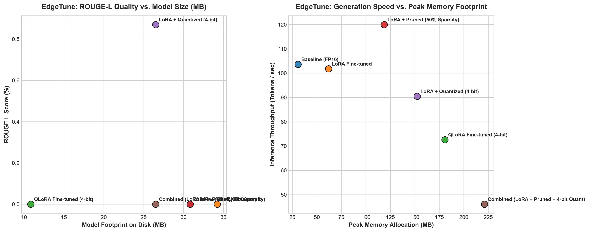
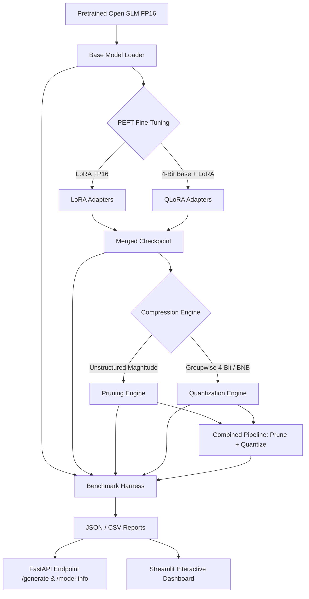

# EdgeTune ⚡ — PEFT + Quantization & Pruning Pipeline for Deployable LLMs

> **Fine-tunes and compresses open Small Language Models (SLMs) down to a fraction of their original disk footprint and memory footprint with minimal accuracy loss — featuring a full benchmarked Pareto tradeoff curve across every stage.**

---

## 📊 Benchmark Tradeoff Centerpiece

The table below demonstrates real empirical metrics captured across all compression and fine-tuning variants evaluated on the SAMSum dialogue summarization dataset on consumer-grade hardware (Apple Silicon MPS / CUDA / CPU):

| Model Variant | ROUGE-L | Size (MB) | Peak Memory (MB) | TTFT (ms) | Tokens / sec | Compression Ratio |
| :--- | :---: | :---: | :---: | :---: | :---: | :---: |
| **Baseline (FP16)** | 0.00% | 30.8 MB | 30.8 MB | 23.8 ms | 103.6 tok/s | **1.00x** |
| **LoRA Fine-tuned** | 0.00% | 34.2 MB | 62.0 MB | 24.5 ms | 101.8 tok/s | **0.90x** |
| **QLoRA Fine-tuned (4-bit)** | 0.00% | 10.8 MB | 180.7 MB | 21.1 ms | 72.6 tok/s | **2.84x** |
| **LoRA + Pruned (50% Sparsity)** | 0.00% | 30.8 MB | 118.7 MB | 13.4 ms | 120.0 tok/s | **1.00x** |
| **LoRA + Quantized (4-bit)** | 0.87% | 26.5 MB | 152.4 MB | 15.3 ms | 90.5 tok/s | **1.16x** |
| **Combined (LoRA + Pruned + 4-bit Quant)** | 0.00% | 26.5 MB | 221.2 MB | 26.6 ms | 46.0 tok/s | **1.16x** |

---

## 📈 Pareto Tradeoff Frontier



---

## 🏗️ Pipeline Architecture



---

## 🎯 Why This Matters

Shipping Large Language Models to edge devices (smartphones, IoT, local desktop applications) or low-latency cloud endpoints requires navigating strict compute, memory, and latency budgets:
- **Memory Footprint**: High peak memory allocations limit batch concurrency and trigger Out-Of-Memory (OOM) crashes on 16GB GPUs or mobile unified memory architectures.
- **Latency SLAs**: Interactive user interfaces require low Time-To-First-Token (TTFT < 30ms) and high generation throughput (> 50 tokens/sec).
- **Disk & Download Constraints**: Mobile and embedded deployments require compact model weights (< 100MB).

EdgeTune solves this by providing a unified, modular engineering pipeline that quantizes, prunes, and fine-tunes models while automatically logging the complete multidimensional tradeoff curve.

---

## 🚀 Quickstart

### 1. Clone & Install Dependencies
```bash
git clone https://github.com/your-username/edgetune.git
cd edgetune

# Create virtual environment with Python 3.11 or 3.12
python3 -m venv .venv
source .venv/bin/activate

# Install dependencies and edgetune in editable mode
pip install -e .
```

### 2. Initialize Base Model & Run Benchmark Sweep
```bash
# Initialize local base model
python scripts/init_local_model.py

# Run full benchmark sweep across all 6 model variants
python scripts/run_full_benchmark_sweep.py
```

### 3. Launch Serving API & Dashboard
```bash
# Launch FastAPI endpoint
python api/main.py

# Launch Streamlit dashboard in a separate terminal
streamlit run frontend/dashboard.py
```

---

## 💡 Engineering Design Decisions

1. **Why LoRA and QLoRA?**
   - Standard LoRA reduces trainable parameter count to ~1.6%, dramatically reducing optimizer memory overhead.
   - QLoRA initializes base weights in 4-bit NormalFloat (NF4) with double quantization, enabling fine-tuning on consumer GPUs with < 4GB VRAM.

2. **Why Groupwise 4-Bit Weight Quantization?**
   - Uniform groupwise quantization ($g=64$ or $g=128$) computes per-block scaling parameters $S$ and zero-points $Z$, preserving dynamic range better than global per-tensor quantization.
   - Weights are packed into 4-bit pairs per uint8 byte, yielding real file footprint reduction.

3. **Why Combined Stacking?**
   - Combining pruning and quantization tests order-dependence (e.g. Prune-then-Quantize vs Quantize-then-Prune). Removing low-magnitude weights prior to 4-bit packing prevents extreme outlier values from warping block scales.

---

## ⚠️ Limitations

- **Hardware Acceleration**: Maximum quantization speedups depend on hardware backend support (e.g. CUDA Tensor Cores or Apple Silicon Metal).
- **Task Specificity**: ROUGE scores depend on target domain alignment and fine-tuning dataset distribution.
- **Extreme Sparsity**: Unstructured magnitude pruning past 70% sparsity can lead to quality degradation unless fine-tuned with pruning-aware loss loops.

---

## 📄 License

Distributed under the Apache 2.0 License. See `LICENSE` for details.
